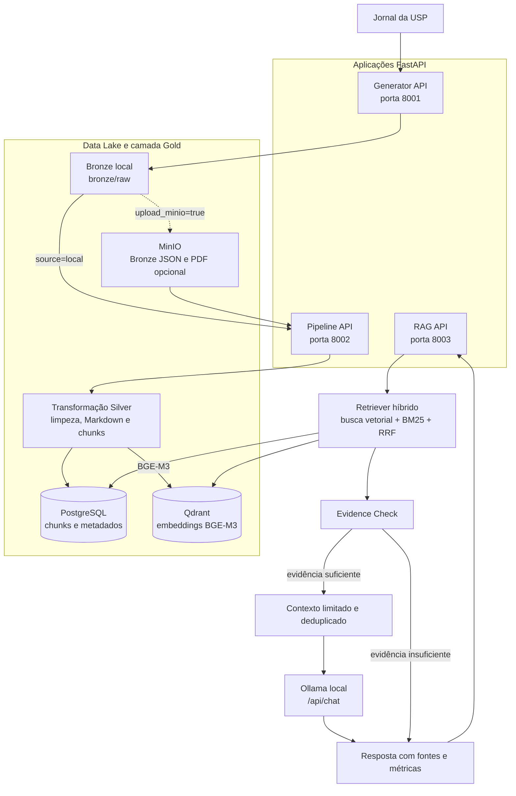

# Arquitetura do sistema

```mermaid
flowchart TD
    JUSP["Jornal da USP"]

    subgraph APIs["Aplicações FastAPI"]
        GEN["Generator API<br/>porta 8001"]
        PIPE["Pipeline API<br/>porta 8002"]
        RAG["RAG API<br/>porta 8003"]
    end

    subgraph DL["Data Lake e camada Gold"]
        LOCAL["Bronze local<br/>bronze/raw"]
        MINIO["MinIO<br/>Bronze JSON e PDF opcional"]
        SILVER["Transformação Silver<br/>limpeza, Markdown e chunks"]
        PG[("PostgreSQL<br/>chunks e metadados")]
        QD[("Qdrant<br/>embeddings BGE-M3")]
    end

    RET["Retriever híbrido<br/>busca vetorial + BM25 + RRF"]
    EVID["Evidence Check"]
    CTX["Contexto limitado e deduplicado"]
    OLLAMA["Ollama local<br/>/api/chat"]
    RESP["Resposta com fontes e métricas"]

    JUSP --> GEN
    GEN --> LOCAL
    LOCAL -.->|"upload_minio=true"| MINIO
    LOCAL -->|"source=local"| PIPE
    MINIO --> PIPE
    PIPE --> SILVER
    SILVER --> PG
    SILVER -->|"BGE-M3"| QD
    RAG --> RET
    RET --> QD
    RET --> PG
    RET --> EVID
    EVID -->|"evidência suficiente"| CTX
    CTX --> OLLAMA
    OLLAMA --> RESP
    EVID -->|"evidência insuficiente"| RESP
    RESP --> RAG
```
