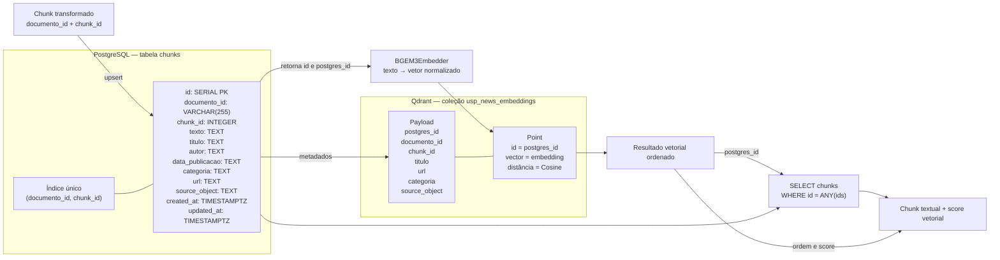

# Persistência e identidade dos dados

```mermaid
flowchart LR
    RECORD["Chunk transformado<br/>documento_id + chunk_id"]

    subgraph POSTGRES["PostgreSQL — tabela chunks"]
        ROW["id: SERIAL PK<br/>documento_id: VARCHAR(255)<br/>chunk_id: INTEGER<br/>texto: TEXT<br/>titulo: TEXT<br/>autor: TEXT<br/>data_publicacao: TEXT<br/>categoria: TEXT<br/>url: TEXT<br/>source_object: TEXT<br/>created_at: TIMESTAMPTZ<br/>updated_at: TIMESTAMPTZ"]
        UNIQUE["Índice único<br/>(documento_id, chunk_id)"]
    end

    EMB["BGEM3Embedder<br/>texto → vetor normalizado"]

    subgraph QDRANT["Qdrant — coleção usp_news_embeddings"]
        POINT["Point<br/>id = postgres_id<br/>vector = embedding<br/>distância = Cosine"]
        PAYLOAD["Payload<br/>postgres_id<br/>documento_id<br/>chunk_id<br/>titulo<br/>url<br/>categoria<br/>source_object"]
    end

    QUERY["Resultado vetorial ordenado"]
    LOOKUP["SELECT chunks<br/>WHERE id = ANY(ids)"]
    JOINED["Chunk textual + score vetorial"]

    RECORD -->|"upsert"| ROW
    UNIQUE --- ROW
    ROW -->|"retorna id e postgres_id"| EMB
    EMB --> POINT
    ROW -->|"metadados"| PAYLOAD
    PAYLOAD --- POINT
    POINT --> QUERY
    QUERY -->|"postgres_id"| LOOKUP
    ROW --> LOOKUP
    LOOKUP --> JOINED
    QUERY -->|"ordem e score"| JOINED
```
