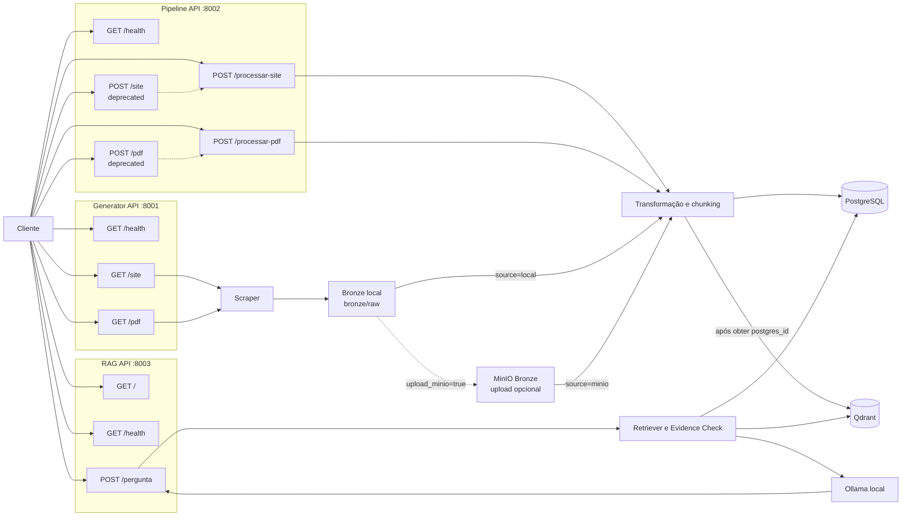

# Fluxo das APIs

```mermaid
flowchart LR
    CLIENT["Cliente"]

    subgraph G["Generator API :8001"]
        GH["GET /health"]
        GS["GET /site"]
        GP["GET /pdf"]
    end

    subgraph P["Pipeline API :8002"]
        PH["GET /health"]
        PS["POST /processar-site"]
        PP["POST /processar-pdf"]
        PSA["POST /site<br/>deprecated"]
        PPA["POST /pdf<br/>deprecated"]
    end

    subgraph R["RAG API :8003"]
        RR["GET /"]
        RH["GET /health"]
        RQ["POST /pergunta"]
    end

    SCRAPER["Scraper"]
    LOCAL["Bronze local<br/>bronze/raw"]
    MINIO["MinIO Bronze<br/>upload opcional"]
    TRANSFORM["Transformação e chunking"]
    PG[("PostgreSQL")]
    QD[("Qdrant")]
    RET["Retriever e Evidence Check"]
    OLLAMA["Ollama local"]

    CLIENT --> GH
    CLIENT --> GS
    CLIENT --> GP
    GS --> SCRAPER
    GP --> SCRAPER
    SCRAPER --> LOCAL
    LOCAL -.->|"upload_minio=true"| MINIO

    CLIENT --> PH
    CLIENT --> PS
    CLIENT --> PP
    CLIENT --> PSA
    CLIENT --> PPA
    PSA -.-> PS
    PPA -.-> PP
    PS --> TRANSFORM
    PP --> TRANSFORM
    LOCAL -->|"source=local"| TRANSFORM
    MINIO -->|"source=minio"| TRANSFORM
    TRANSFORM --> PG
    TRANSFORM -->|"após obter postgres_id"| QD

    CLIENT --> RR
    CLIENT --> RH
    CLIENT --> RQ
    RQ --> RET
    RET --> PG
    RET --> QD
    RET --> OLLAMA
    OLLAMA --> RQ
```
