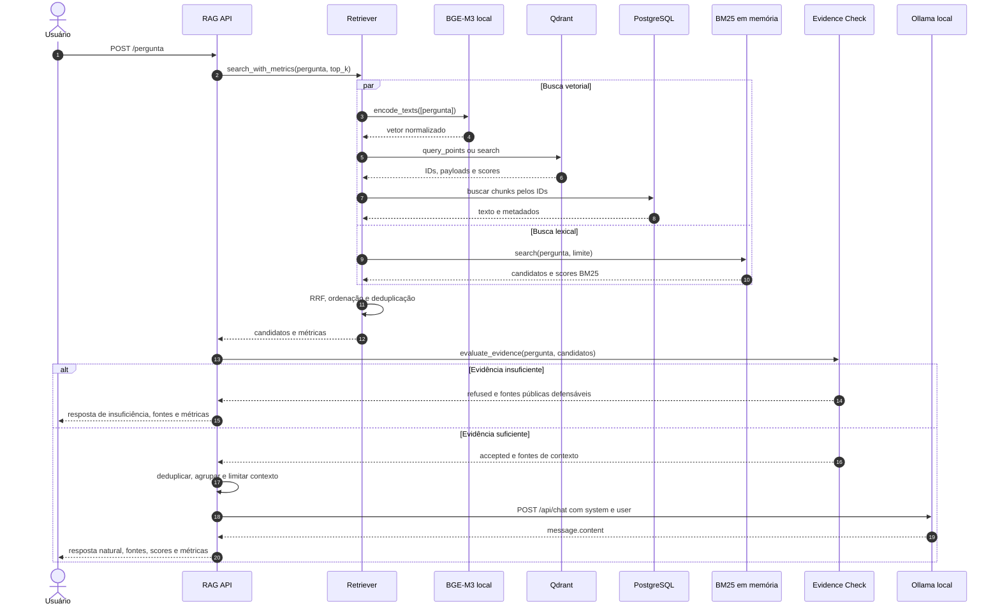

# Fluxo conversacional do chatbot

```mermaid
sequenceDiagram
    autonumber
    actor U as Usuário
    participant API as RAG API
    participant RET as Retriever
    participant BGE as BGE-M3 local
    participant QD as Qdrant
    participant PG as PostgreSQL
    participant BM as BM25 em memória
    participant EV as Evidence Check
    participant OL as Ollama local

    U->>API: POST /pergunta
    API->>RET: search_with_metrics(pergunta, top_k)

    par Busca vetorial
        RET->>BGE: encode_texts([pergunta])
        BGE-->>RET: vetor normalizado
        RET->>QD: query_points ou search
        QD-->>RET: IDs, payloads e scores
        RET->>PG: buscar chunks pelos IDs
        PG-->>RET: texto e metadados
    and Busca lexical
        RET->>BM: search(pergunta, limite)
        BM-->>RET: candidatos e scores BM25
    end

    RET->>RET: RRF, ordenação e deduplicação
    RET-->>API: candidatos e métricas
    API->>EV: evaluate_evidence(pergunta, candidatos)

    alt Evidência insuficiente
        EV-->>API: refused e fontes públicas defensáveis
        API-->>U: resposta de insuficiência, fontes e métricas
    else Evidência suficiente
        EV-->>API: accepted e fontes de contexto
        API->>API: deduplicar, agrupar e limitar contexto
        API->>OL: POST /api/chat com system e user
        OL-->>API: message.content
        API-->>U: resposta natural, fontes, scores e métricas
    end
```
