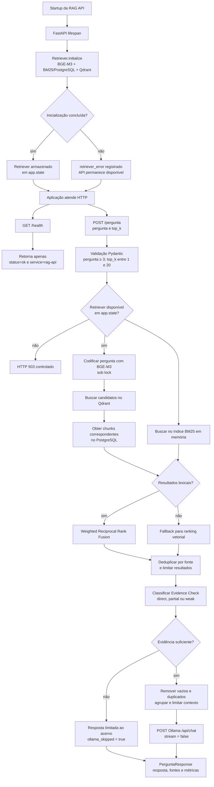

# Fluxo interno da RAG

```mermaid
flowchart TD
    START["Startup da RAG API"]
    LIFE["FastAPI lifespan"]
    INIT["Retriever.initialize<br/>BGE-M3 + BM25/PostgreSQL + Qdrant"]
    INITOK{"Inicialização concluída?"}
    STATEOK["Retriever armazenado<br/>em app.state"]
    STATEERR["retriever_error registrado<br/>API permanece disponível"]
    READY["Aplicação atende HTTP"]
    HEALTH["GET /health"]
    HEALTHRESP["Retorna apenas<br/>status=ok e service=rag-api"]
    REQ["POST /pergunta<br/>pergunta e top_k"]
    VALID["Validação Pydantic<br/>pergunta ≥ 3; top_k entre 1 e 20"]
    GETRET{"Retriever disponível<br/>em app.state?"}
    ERR503["HTTP 503 controlado"]
    EMB["Codificar pergunta com BGE-M3<br/>sob lock"]
    VEC["Buscar candidatos no Qdrant"]
    FETCH["Obter chunks correspondentes<br/>no PostgreSQL"]
    BM25["Buscar no índice BM25 em memória"]
    FALLBACK{"Resultados lexicais?"}
    RRF["Weighted Reciprocal Rank Fusion"]
    VECTORONLY["Fallback para ranking vetorial"]
    DEDUP["Deduplicar por fonte<br/>e limitar resultados"]
    EVID["Classificar Evidence Check<br/>direct, partial ou weak"]
    SUFFICIENT{"Evidência suficiente?"}
    REFUSAL["Resposta limitada ao acervo<br/>ollama_skipped = true"]
    CONTEXT["Remover vazios e duplicados<br/>agrupar e limitar contexto"]
    OLLAMA["POST Ollama /api/chat<br/>stream = false"]
    RESPONSE["PerguntaResponse<br/>resposta, fontes e métricas"]

    START --> LIFE
    LIFE --> INIT
    INIT --> INITOK
    INITOK -->|"sim"| STATEOK
    INITOK -->|"não"| STATEERR
    STATEOK --> READY
    STATEERR --> READY
    READY --> HEALTH
    HEALTH --> HEALTHRESP
    READY --> REQ
    REQ --> VALID
    VALID --> GETRET
    GETRET -->|"não"| ERR503
    GETRET -->|"sim"| EMB
    EMB --> VEC
    VEC --> FETCH
    FETCH --> FALLBACK
    GETRET --> BM25
    BM25 --> FALLBACK
    FALLBACK -->|"sim"| RRF
    FALLBACK -->|"não"| VECTORONLY
    RRF --> DEDUP
    VECTORONLY --> DEDUP
    DEDUP --> EVID
    EVID --> SUFFICIENT
    SUFFICIENT -->|"não"| REFUSAL
    REFUSAL --> RESPONSE
    SUFFICIENT -->|"sim"| CONTEXT
    CONTEXT --> OLLAMA
    OLLAMA --> RESPONSE
```
