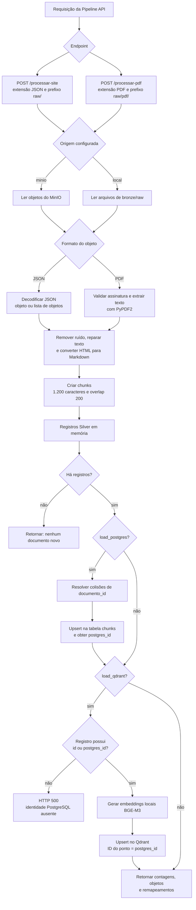

# Pipeline de dados

```mermaid
flowchart TD
    START["Requisição da Pipeline API"]
    KIND{"Endpoint"}
    SITE["POST /processar-site<br/>extensão JSON e prefixo raw/"]
    PDF["POST /processar-pdf<br/>extensão PDF e prefixo raw/pdf/"]
    SOURCE{"Origem configurada"}
    MINIO["Ler objetos do MinIO"]
    LOCAL["Ler arquivos de bronze/raw"]
    DECODE{"Formato do objeto"}
    JSON["Decodificar JSON<br/>objeto ou lista de objetos"]
    PDFREAD["Validar assinatura e extrair texto<br/>com PyPDF2"]
    NORMALIZE["Remover ruído, reparar texto<br/>e converter HTML para Markdown"]
    CHUNK["Criar chunks<br/>1.200 caracteres e overlap 200"]
    RECORDS["Registros Silver em memória"]
    HAS{"Há registros?"}
    EMPTY["Retornar: nenhum documento novo"]
    LOADPG{"load_postgres?"}
    COLLISION["Resolver colisões de documento_id"]
    PG["Upsert na tabela chunks<br/>e obter postgres_id"]
    LOADQD{"load_qdrant?"}
    IDENTITY{"Registro possui<br/>id ou postgres_id?"}
    INVALID["HTTP 500<br/>identidade PostgreSQL ausente"]
    EMB["Gerar embeddings locais BGE-M3"]
    QD["Upsert no Qdrant<br/>ID do ponto = postgres_id"]
    RESULT["Retornar contagens, objetos<br/>e remapeamentos"]

    START --> KIND
    KIND --> SITE
    KIND --> PDF
    SITE --> SOURCE
    PDF --> SOURCE
    SOURCE -->|"minio"| MINIO
    SOURCE -->|"local"| LOCAL
    MINIO --> DECODE
    LOCAL --> DECODE
    DECODE -->|"JSON"| JSON
    DECODE -->|"PDF"| PDFREAD
    JSON --> NORMALIZE
    PDFREAD --> NORMALIZE
    NORMALIZE --> CHUNK
    CHUNK --> RECORDS
    RECORDS --> HAS
    HAS -->|"não"| EMPTY
    HAS -->|"sim"| LOADPG
    LOADPG -->|"sim"| COLLISION
    COLLISION --> PG
    PG --> LOADQD
    LOADPG -->|"não"| LOADQD
    LOADQD -->|"sim"| IDENTITY
    IDENTITY -->|"sim"| EMB
    IDENTITY -->|"não"| INVALID
    EMB --> QD
    QD --> RESULT
    LOADQD -->|"não"| RESULT
```
